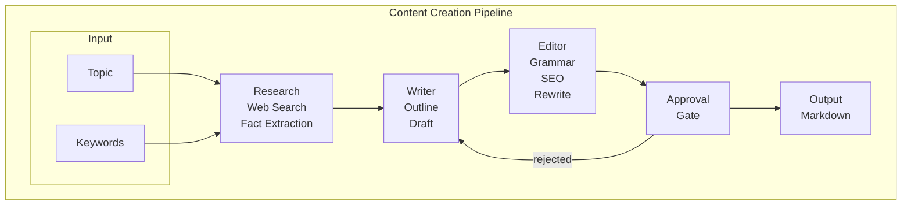

# Content Creation Studio

[](https://www.python.org/)
[](https://python.langchain.com/)
[](https://langchain-ai.github.io/langgraph/)
[](tests/)

A multi-agent AI content generation system built with LangGraph that orchestrates research, writing, and editing workflows to produce SEO-optimized content.

## Project Description

Content Creation Studio is an agentic AI system that automates the creation of high-quality, SEO-optimized content through a linear pipeline. The system uses LangGraph to orchestrate research, writer, and editor agents in sequence, leveraging web search for real-time information and LLM capabilities for content generation and refinement.

### What the Application Does

- **Research Agent**: Searches the web using DuckDuckGo to gather relevant facts and information on any topic
- **Writer Agent**: Generates structured content drafts based on research findings
- **Editor Agent**: Performs grammar checking, SEO optimization, and professional rewriting
- **Approval Gate**: Human review step before final output

### Why These Technologies

| Technology | Purpose |
|------------|---------|
| **LangGraph** | Multi-agent orchestration with state management and conditional routing |
| **DuckDuckGo (ddgs)** | Free web search without API keys for real-time research |
| **LangChain/LangChain-OpenAI** | LLM integration for content generation and fact extraction |
| **TypedDict** | Type-safe state management throughout the pipeline |

### Challenges and Future Features

- **Current**: Graceful fallback when web search is unavailable (uses LLM knowledge)
- **Future**: Support for SerpAPI/ Tavily for more reliable search
- **Future**: FastAPI REST endpoints for programmatic access
- **Future**: Batch processing for multiple articles
- **Future**: Content templates for different article types

---

## Architecture

This is a **linear pipeline** architecture where each agent processes the output of the previous one. No supervisor routing is needed - the workflow executes in sequence:



### Pipeline Stages

| Stage | Agent | Responsibilities |
|-------|-------|-----------------|
| 1 | **Research** | Web search via DuckDuckGo, extract facts with LLM |
| 2 | **Writer** | Create outline, generate draft from facts |
| 3 | **Editor** | Grammar check, SEO optimization, professional rewrite |
| 4 | **Approval** | Human review - approve or reject for revision |
| 5 | **Output** | Save final content as Markdown file |

### Rejection Flow

If content is **rejected** at the Approval gate, it loops back to the Writer agent for revision, then flows through Editor and Approval again.

---

## Installation

### Prerequisites

- Python 3.13 or higher
- Virtual environment (recommended)

### Steps

```bash
# Clone the repository
git clone <repository-url>
cd content-creation-studio

# Create virtual environment
python -m venv venv

# Activate virtual environment (Windows)
.\venv\Scripts\activate

# Or on Unix/MacOS
source venv/bin/activate

# Install dependencies
pip install -r requirements.txt

# Configure environment variables
copy .env .env
# Edit .env and set your MINIMAX_API_KEY
```

### Environment Variables

Create a `.env` file based on the template:

```env
# Required: MiniMax API Key for LLM capabilities
MINIMAX_API_KEY=your-api-key-here

# Optional: Custom endpoint (defaults to https://api.minimax.io/v1)
MINIMAX_ENDPOINT=https://api.minimax.io/v1

# Optional: Model name (defaults to minimax-m2.7)
MODEL_NAME=minimax-m2.7
```

---

## Usage

### Command Line Interface

```bash
# Run with default settings
python src/main.py --topic "Benefits of remote work"

# With keywords
python src/main.py --topic "Python programming" --keywords "python,coding,tutorial"

# With custom output file
python src/main.py --topic "AI in healthcare" --output output/article.md
```

### Output

The system generates a markdown file in the `output/` directory with:
- Research facts and sources
- Structured content draft
- SEO-optimized final content

---

## Project Structure

```
content-creation-studio/
├── src/
│   ├── agents/
│   │   ├── editor_agent.py      # Final review & approval
│   │   ├── research_agent.py    # Web search & fact extraction
│   │   ├── writer_agent.py      # Draft generation
│   │   └── __init__.py
│   ├── api/
│   │   ├── routes.py            # Future FastAPI routes
│   │   └── __init__.py
│   ├── state/
│   │   ├── content_state.py     # TypedDict for LangGraph state
│   │   └── __init__.py
│   ├── tools/
│   │   ├── search_tools.py      # DuckDuckGo web search
│   │   ├── seo_tools.py         # Grammar, SEO, rewrite tools
│   │   ├── writing_tools.py     # Draft generation tools
│   │   └── __init__.py
│   ├── workflow/
│   │   ├── content_graph.py      # LangGraph StateGraph
│   │   └── __init__.py
│   ├── __init__.py
│   └── main.py                  # CLI entry point
├── tests/
│   ├── __init__.py
│   ├── test_agents.py           # Agent tests (6 tests)
│   ├── test_state.py            # State structure tests (5 tests)
│   ├── test_tools.py            # Tool integration tests (8 tests)
│   └── test_workflow.py         # Workflow tests (8 tests)
├── output/                      # Generated content directory
├── .env                         # Environment configuration
├── .gitignore
├── requirements.txt             # Pinned dependencies
├── README.md                     # This file
└── specifications.md            # Full specification document
```

---

## API Reference (Future)

REST API endpoints will be available at `/api/v1`:

| Endpoint | Method | Description |
|----------|--------|-------------|
| `/generate` | POST | Generate content for a topic |
| `/status/{job_id}` | GET | Check generation status |
| `/cancel/{job_id}` | DELETE | Cancel generation job |

---

## Credits

### Technologies Used

- [LangGraph](https://langchain-ai.github.io/langgraph/) - Multi-agent orchestration
- [LangChain](https://langchain.com/) - LLM framework
- [DuckDuckGo (ddgs)](https://github.com/NUKIE77/ddgs) - Free web search
- [MiniMax](https://www.minimax.io/) - LLM API provider

### Documentation

- [LangGraph Documentation](https://langchain-ai.github.io/langgraph/)
- [LangChain OpenAI Integration](https://python.langchain.com/docs/integrations/chat/openai)

---

## Testing

```bash
# Run all tests
.\venv\Scripts\python.exe -m pytest tests/ -v

# Run specific test file
.\venv\Scripts\python.exe -m pytest tests/test_tools.py -v

# Run with coverage
.\venv\Scripts\python.exe -m pytest tests/ --cov=src
```

### Test Results

```
tests/test_agents.py     -  6 tests passed
tests/test_state.py      -  5 tests passed
tests/test_tools.py      -  8 tests passed (real web search verified)
tests/test_workflow.py   -  8 tests passed
=============================================
Total: 27 passed
```

---

## Contributing

Contributions are welcome! Please follow these guidelines:

### Contributor Covenant

By participating, you are expected to uphold this project's code of conduct.

### How to Contribute

1. Fork the repository
2. Create a feature branch (`git checkout -b feature/amazing-feature`)
3. Commit your changes (`git commit -m 'Add amazing feature'`)
4. Push to the branch (`git push origin feature/amazing-feature`)
5. Open a Pull Request

### Coding Standards

- Use type hints for all function signatures
- Follow PEP 8 style guidelines
- Write tests for new features
- Update documentation for API changes

---

## Badges

[](https://www.python.org/)
[](https://python.langchain.com/)
[](https://langchain-ai.github.io/langgraph/)
