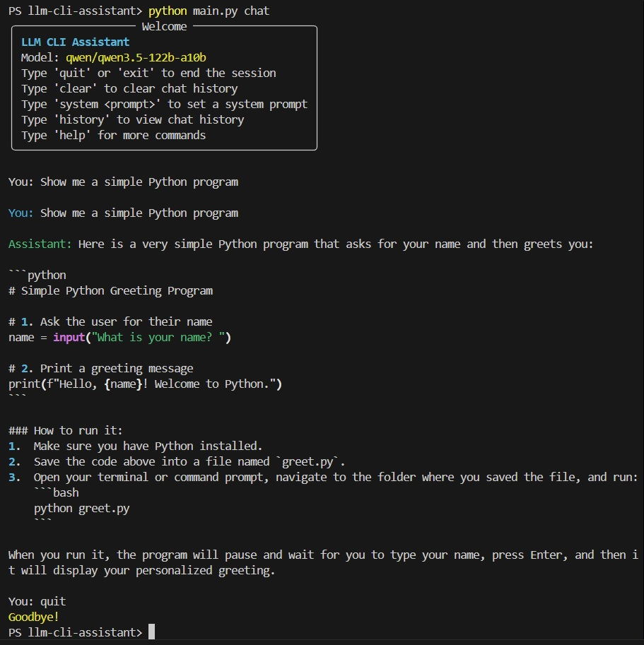

# LLM CLI Assistant

A command-line interface for interacting with Large Language Models via NVIDIA's API, featuring real-time streaming, chat history, and customizable system prompts.

## 1. Problem

This project solves the need for a **lightweight, terminal-based AI assistant** that allows developers and users to:

- Interact with LLMs directly from the command line
- Experience real-time streaming responses (rather than waiting for complete responses)
- Maintain conversation context across multiple exchanges
- Customize AI behavior through system prompts
- Integrate with NVIDIA's API featuring the powerful Qwen 3.5 model

**Target Users:**
- Developers wanting quick AI assistance without browser overhead
- CLI enthusiasts who prefer terminal workflows
- Users exploring LLM capabilities through a minimal interface

---

## 2. Architecture

### System Overview

```
┌─────────────────────────────────────────────────────────────┐
│                      CLI Interface                          │
│                    (Typer + Rich UI)                        │
└─────────────────────────┬───────────────────────────────────┘
                          │
                          ▼
┌─────────────────────────────────────────────────────────────┐
│                    Application Layer                        │
│  ┌─────────────┐  ┌──────────────┐  ┌────────────────┐      │
│  │ chat()      │  │ process_msg()│  │ interactive    │      │
│  │ command     │  │              │  │ mode           │      │
│  └─────────────┘  └──────────────┘  └────────────────┘      │
└─────────────────────────┬───────────────────────────────────┘
                          │
                          ▼
┌─────────────────────────────────────────────────────────────┐
│                    LangChain Layer                          │
│  ┌──────────────┐  ┌────────────────┐  ┌──────────────┐     │
│  │ build_msgs() │  │ ChatOpenAI     │  │ stream_resp()│     │
│  │              │  │ client         │  │              │     │
│  └──────────────┘  └────────────────┘  └──────────────┘     │
└─────────────────────────┬───────────────────────────────────┘
                          │
                          ▼
┌─────────────────────────────────────────────────────────────┐
│                    External API                             │
│              NVIDIA NIM (qwen/qwen3.5-122b-a10b)            │
└─────────────────────────────────────────────────────────────┘
```

### Components

| Component | Technology | Purpose |
|-----------|------------|---------|
| CLI Framework | Typer | Command parsing, options, help |
| Terminal UI | Rich | Colored output, panels, formatting |
| LLM Client | langchain-openai | OpenAI-compatible API client |
| Chat Context | langchain-core | Message classes (Human, AI, System) |
| Configuration | python-dotenv | Environment variable management |

### Key Files

- **[`main.py`](main.py:1)** - Main application with all CLI commands
- **[`config.py`](config.py:1)** - Configuration loader
- **[`.env`](.env:1)** - Environment variables (API keys, model)
- **[`requirements.txt`](requirements.txt:1)** - Python dependencies
- **`venv/`** - Virtual environment (created via `python -m venv venv`)

---

## 3. Demo

### Quick Start

```bash
# Activate virtual environment
call venv\Scripts\activate.bat

# Run the CLI
python main.py chat "Show me a simple Python program"
```

### Interactive Mode

```bash
python main.py chat
```

Available commands within interactive mode:
- `quit` or `exit` - End session
- `clear` - Clear chat history
- `history` - View conversation history
- `system <prompt>` - Set system prompt
- `help` - Show help



### Feature Examples

#### Streaming Response
```bash
python main.py chat "Write a Python function to calculate fibonacci"
```
Shows response in real-time as chunks arrive.

#### Custom System Prompt
```bash
python main.py chat -s "You are a Python programming expert" "Explain decorators"
```

#### Clear History
```bash
python main.py chat --clear
```

#### Model Override
```bash
python main.py chat -m minimax/minimax-m2.5 "Hello"
```

---

## 4. Key Engineering Challenges

### Challenge 1: Response Streaming
**Problem:** How to display AI responses in real-time rather than waiting for the complete response.

**Solution:** Use LangChain's `stream()` method which yields chunks as they arrive:
```python
for chunk in llm.stream(messages):
    rprint(chunk.content, end="")  # Print immediately
```

### Challenge 2: Chat Context Management
**Problem:** The LLM needs conversation history to maintain context.

**Solution:** Maintain a `chat_history` list and rebuild messages on each request:
```python
def build_messages(user_input):
    messages = [SystemMessage(content=system_prompt)]  # Persona
    for msg in chat_history:
        messages.append(HumanMessage/AIMessage)        # Context
    messages.append(HumanMessage(content=user_input))   # Current
    return messages
```

### Challenge 3: Context Window Limits
**Problem:** Chat history can exceed the model's context window.

**Current Limitation:** All history is sent; future enhancement needed for truncation.

### Challenge 4: API Compatibility
**Problem:** Using NVIDIA's API which has a different endpoint than OpenAI.

**Solution:** Configure `base_url` in ChatOpenAI:
```python
ChatOpenAI(
    base_url="https://integrate.api.nvidia.com/v1",
    model="qwen/qwen3.5-122b-a10b"
)
```

---

## 5. Benchmarks

| Metric | Value | Notes |
|--------|-------|-------|
| **Model** | Qwen 3.5 122B | 122 billion parameters |
| **Context Window** | ~128K tokens | For Qwen 3.5 |
| **API Latency** | Varies | Network-dependent |
| **Streaming** | Enabled by default | Real-time chunk delivery |
| **Startup Time** | ~1-2 seconds | Includes venv activation |

### Test Results

| Test Case | Result |
|-----------|--------|
| Single message | ✅ Success |
| Multi-turn conversation | ✅ Context maintained |
| System prompt override | ✅ Behavior changes |
| Streaming mode | ✅ Real-time output |
| Non-streaming mode | ✅ Full response |

---

## 6. Tradeoffs

### Advantages

| Benefit | Description |
|---------|-------------|
| **Lightweight** | Minimal dependencies, fast startup |
| **Flexible** | Custom prompts, model override |
| **Interactive** | Real-time streaming UX |
| **Portable** | Works on any system with Python |

### Limitations

| Limitation | Impact |
|------------|--------|
| **No persistence** | Chat history lost on exit |
| **Context overflow** | No automatic truncation yet |
| **Single session** | No multi-chat support |
| **API dependency** | Requires internet connection |

### Design Choices

| Choice | Rationale |
|--------|-----------|
| **Rich over raw print** | Better UX with colors/panels |
| **Typer over argparse** | Cleaner CLI with auto-help |
| **In-memory history** | Simplicity over persistence |
| **Streaming default** | Better perceived performance |

---

## 7. Future Work

### High Priority

- [ ] **Context Window Handling** - Implement token counting and automatic truncation when approaching context limit
- [ ] **Chat Persistence** - Save/load conversation history to JSON files
- [ ] **Multiple Chats** - Support for multiple chat sessions with session management

### Medium Priority

- [ ] **Voice Input** - Add speech-to-text for voice-based interaction
- [ ] **Syntax Highlighting** - Code blocks in responses with proper highlighting
- [ ] **Tool Use** - Enable function calling for code execution, file operations

### Lower Priority

- [ ] **Custom Endpoints** - Support for other LLM providers (OpenAI, Anthropic, local models)
- [ ] **Plugin System** - Extensible architecture for custom commands
- [ ] **GUI Option** - Optional web-based interface
- [ ] **Markdown Rendering** - Render Markdown in terminal for rich responses

---

## Installation

```bash
# Clone and navigate to project
cd llm-cli-assistant

# Create virtual environment
python -m venv venv

# Activate (Windows)
call venv\Scripts\activate.bat

# Install dependencies
pip install -r requirements.txt

# Configure environment
# Edit .env with your NVIDIA API key

# Run
python main.py chat
```

---

## License

MIT License
