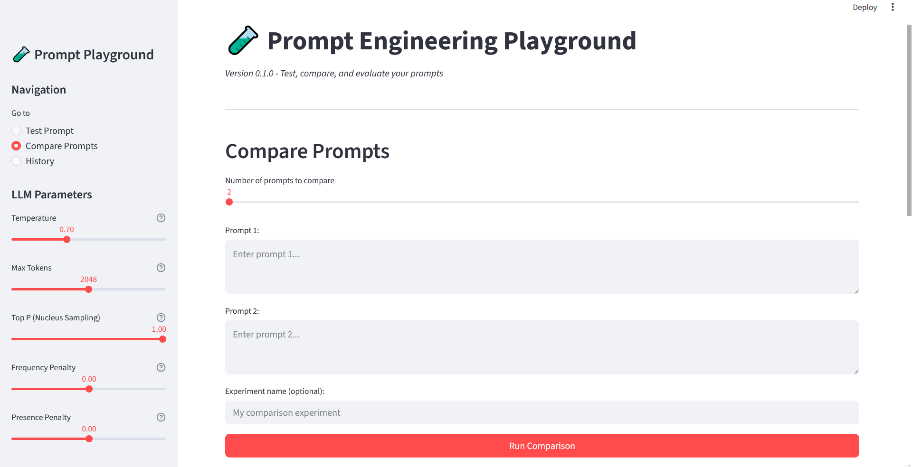

# Prompt Engineering Playground

A Streamlit-based web application for testing, comparing, and evaluating LLM prompts with experiment history tracking.


---

## 1. Problem

Prompt engineering is an iterative process that requires:

- **Testing** individual prompts with various LLM configurations
- **Comparing** multiple prompt variations to find the best approach
- **Evaluating** outputs manually to track quality over time
- **Storing** experiment history for future reference and analysis

Existing tools often lack these capabilities or require expensive enterprise solutions. This project provides a free, self-hosted playground for prompt experimentation.

---

## 2. Architecture

```
┌─────────────────────────────────────────────────────────────┐
│                      Streamlit UI                           │
│  ┌─────────────┐  ┌─────────────┐  ┌─────────────┐          │
│  │ Test Prompt │  │   Compare   │  │   History   │          │
│  │    Page     │  │   Prompts   │  │    Page     │          │
│  └──────┬──────┘  └──────┬──────┘  └──────┬──────┘          │
│         │                │                │                 │
│         └────────────────┼────────────────┘                 │
│                          ▼                                  │
│               ┌─────────────────────┐                       │
│               │   Session State     │                       │
│               └──────────┬──────────┘                       │
└──────────────────────────┼──────────────────────────────────┘
                           ▼
┌──────────────────────────────────────────────────────────────┐
│                    Service Layer                             │
│  ┌────────────────────┐    ┌────────────────────┐            │
│  │  LLM Service       │    │  Database Service  │            │
│  │  (LangChain+NVIDIA)│    │    (SQLite)        │            │
│  └─────────┬──────────┘    └─────────┬──────────┘            │
└────────────┼─────────────────────────┼───────────────────────┘
             ▼                         ▼
┌────────────────────────┐    ┌─────────────────────────┐
│   NVIDIA API           │    │   data/experiments.db   │
│   Llama 3.3 70B        │    │   (SQLite)              │
└────────────────────────┘    └─────────────────────────┘
```

### Technology Stack

| Component | Technology | Version |
|-----------|------------|---------|
| Web Framework | Streamlit | 1.28+ |
| LLM Integration | LangChain | 0.1+ |
| LLM Provider | NVIDIA AI Endpoints | - |
| Model | Llama 3.3 70B Instruct | - |
| Database | SQLite | 3 |
| Data Models | Pydantic | 2.0+ |
| Environment | python-dotenv | 1.0+ |

### Project Structure

```
prompt-engineering-playground/
├── .env                    # API configuration (not committed)
├── .gitignore              # Git ignore rules
├── requirements.txt        # Python dependencies
├── README.md               # This file
├── venv/                   # Virtual environment
├── app/
│   ├── __init__.py
│   ├── main.py             # Streamlit app entry point
│   ├── llm_service.py      # LangChain + NVIDIA integration
│   ├── database.py         # SQLite operations
│   ├── models.py           # Pydantic data models
│   └── utils.py            # UI utilities
├── data/
│   └── experiments.db      # SQLite database
└── plans/
    └── plan.md             # Project planning notes
```

---

## 3. Demo

The application provides three main pages:

### Test Prompt Page
- Enter a single prompt with optional system message
- Configure LLM parameters (temperature, max_tokens, top_p, penalties)
- Execute and view the response
- Rate the output (1-5 stars) with optional feedback

### Compare Prompts Page
- Compare 2-4 prompts side-by-side
- Execute all prompts simultaneously
- View responses in columns
- Rate each response individually



### History Page
- Browse all past experiments
- Filter by type (single/comparison)
- Filter by minimum rating
- Search by prompt text
- Delete experiments
- View full details including parameters

---

## 4. Key Engineering Challenges

### 1. Environment Variable Loading
**Challenge**: Streamlit apps may not load `.env` files automatically.

**Solution**: Explicitly load environment variables using `python-dotenv` in [`app/llm_service.py`](app/llm_service.py:8):

```python
load_dotenv(os.path.join(os.path.dirname(os.path.dirname(__file__)), '.env'))
```

### 2. Module Import Path Resolution
**Challenge**: Running Streamlit from the project root causes module import errors.

**Solution**: Add parent directory to Python path in [`app/main.py`](app/main.py:4):

```python
sys.path.insert(0, os.path.dirname(os.path.dirname(os.path.abspath(__file__))))
```

### 3. LangChain Version Compatibility
**Challenge**: LangChain API changed between versions (schema → messages).

**Solution**: Use the correct import:

```python
from langchain_core.messages import HumanMessage, SystemMessage
```

### 4. Session State Management
**Challenge**: Need to persist responses and experiment IDs across Streamlit reruns.

**Solution**: Use Streamlit's session state:

```python
st.session_state.current_response = response
st.session_state.current_experiment_id = experiment_id
```

---

## 5. Benchmarks

| Operation | Typical Response Time |
|-----------|---------------------|
| Single prompt (2048 tokens) | ~3-5 seconds |
| Comparison (2 prompts) | ~6-10 seconds |
| Database query | <50ms |

### Database Storage

| Metric | Value |
|--------|-------|
| Experiments table size | ~1KB per experiment |
| Comparison results | ~500 bytes per result |
| Query performance | <50ms for 1000 experiments |

---

## 6. Tradeoffs

### Strengths
- ✅ **Self-hosted**: Full control over data and configuration
- ✅ **Free API**: Uses NVIDIA's free tier (rate limits apply)
- ✅ **Lightweight**: No external database required (SQLite)
- ✅ **Extensible**: Easy to add new LLM providers

### Limitations
- ⚠️ **Single-user**: SQLite not suitable for concurrent multi-user access
- ⚠️ **Rate limits**: Subject to NVIDIA API rate limits
- ⚠️ **No authentication**: No user management built-in
- ⚠️ **Local only**: No cloud deployment configurations

---

## 7. Future Work

### Planned Features

1. **Multi-turn Conversations**
   - Implement chat history for follow-up prompts
   - Store conversation threads in database

2. **Export Functionality**
   - Export experiments to JSON/CSV
   - Generate comparison reports

3. **Prompt Templates**
   - Save and reuse common prompt patterns
   - Template variable substitution

4. **Batch Processing**
   - Process multiple prompts from a file
   - Queue system for long-running experiments

5. **User Authentication**
   - Basic auth for multi-user support
   - User-specific experiment history

6. **Additional LLM Providers**
   - OpenAI GPT models
   - Anthropic Claude
   - Ollama for local models

7. **Analytics Dashboard**
   - Rating trends over time
   - Prompt performance metrics

---

## Quick Start

```bash
# Clone and navigate to project
cd prompt-engineering-playground

# Create virtual environment
python -m venv venv

# Activate virtual environment
# Windows:
venv\Scripts\activate
# Linux/Mac:
source venv/bin/activate

# Install dependencies
pip install -r requirements.txt

# Configure environment
# Edit .env with your NVIDIA API key
# (Already configured in this project)

# Run the app
streamlit run app/main.py
```

The app will be available at `http://localhost:8501`

---

## License

MIT License - Feel free to use and modify for your needs.

---

